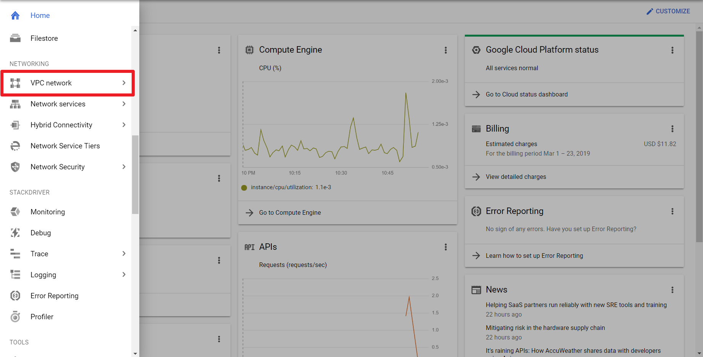
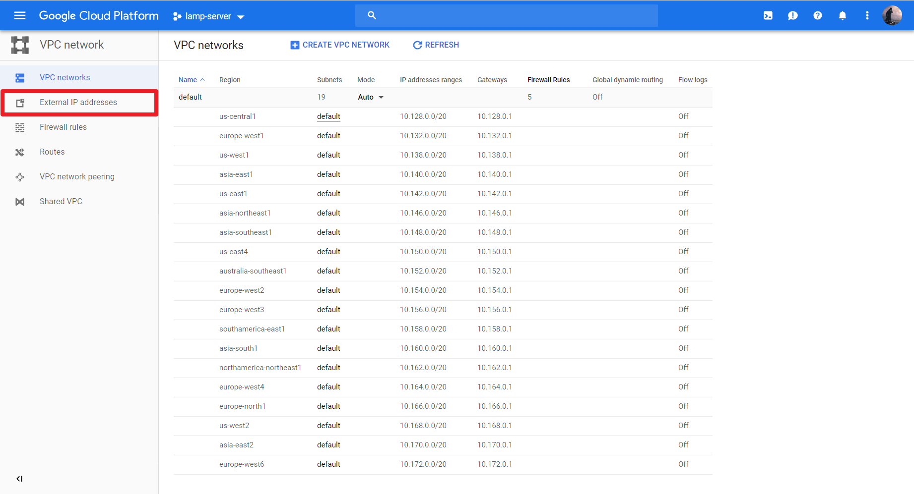
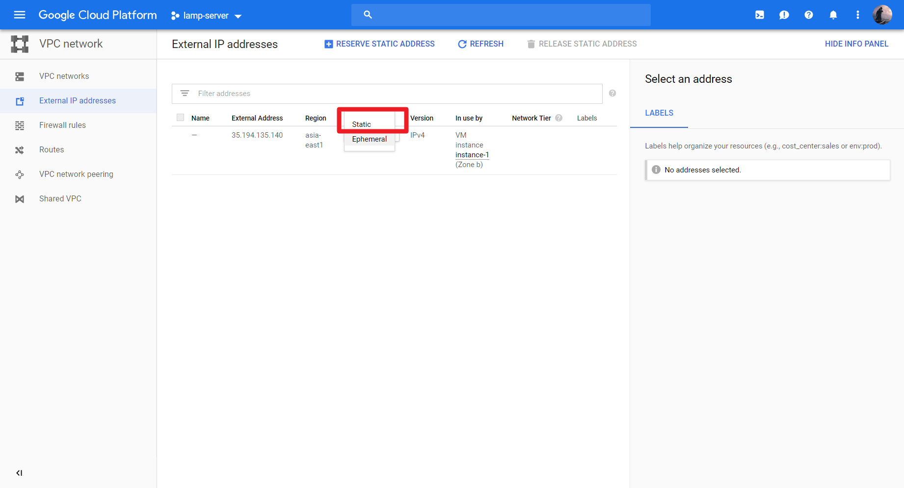
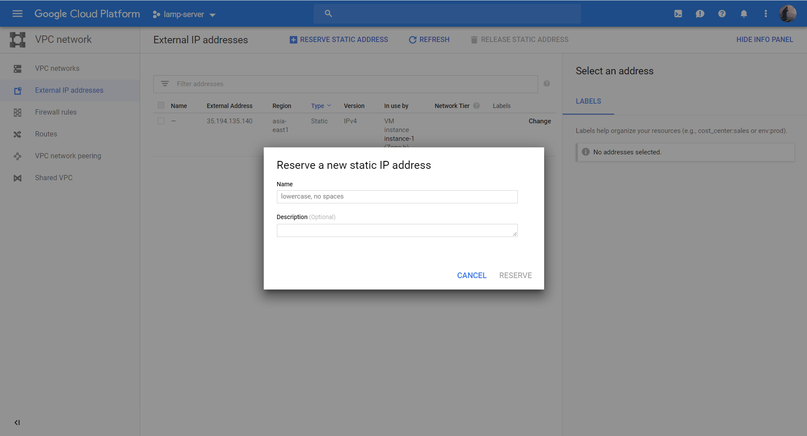
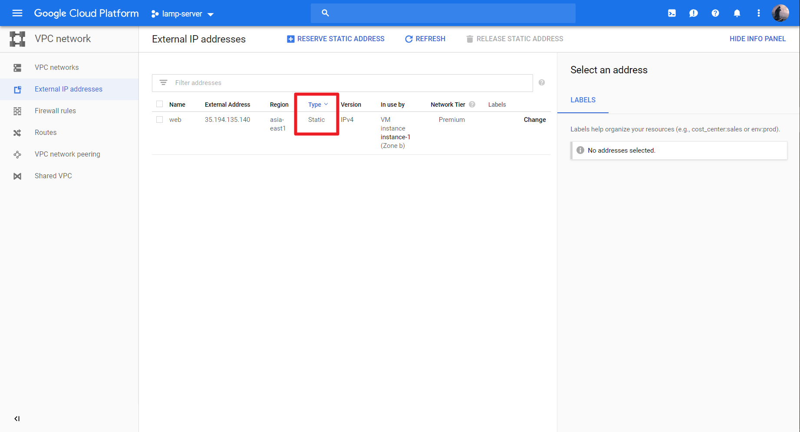

# Google Cloud Platform LAMP Server Setup
Set up LAMP (Linux, Apache2, MySQL, PHP7) on Google Cloud Platform Compute Engine, with OS Debian 9 Stretch.</br>
And connect to Cloud Storage to backup.

## Contents
- [Set up compute engine](https://github.com/cindytsai/Google-Cloud-Platform-LAMP-Server-Setup#set-up-compute-engine)
- [Set up cloud storage](https://github.com/cindytsai/Google-Cloud-Platform-LAMP-Server-Setup#set-up-cloud-storage)
- [Set up your virtual machine](https://github.com/cindytsai/Google-Cloud-Platform-LAMP-Server-Setup#set-up-your-virtual-machine)

## Set Up Compute Engine
###### 1.Create a project


###### 2.Go to Google Compute Engine and create an instance


**Remember to allow full access to all Cloud APIs.**</br>


###### 3.Entering SSH


###### 4.Reserving a static external IP address










## Set Up Cloud Storage
###### 1.Go to Cloud Storage and create a bucket


**For more details :**</br>
[Storage class](https://cloud.google.com/storage/docs/storage-classes)</br>
[Access control model](https://cloud.google.com/storage/docs/access-control/)</br>


## Set Up Your Virtual Machine
###### 1.Update and get Apache2, PHP7, MariaDB(MySQL)
Get the setup script.</br>
```
wget https://raw.githubusercontent.com/cindytsai/Google-Cloud-Platform-LAMP-Server-Setup/master/setup.sh
```
Let setup.sh be executable.</br>
```
chmod 777 setup.sh
```
Run [`setup.sh`](setup.sh).</br>
```
#!/bin/bash

#Update and upgrade server
sudo apt-get -y update
sudo apt-get -y upgrade

#Install MariDB(MySQL)
sudo apt-get install -y mariadb-server mariadb-client
sudo mysql_secure_installation

#Install Apache2
sudo apt-get install -y apache2

#Install PHP7
sudo apt-get install -y php7.0 php7.0-mysql libapache2-mod-php7.0 php7.0-curl
sudo service apache2 restart

#Getting some tools if you needed
sudo apt-get install -y git tree
```

###### 2.