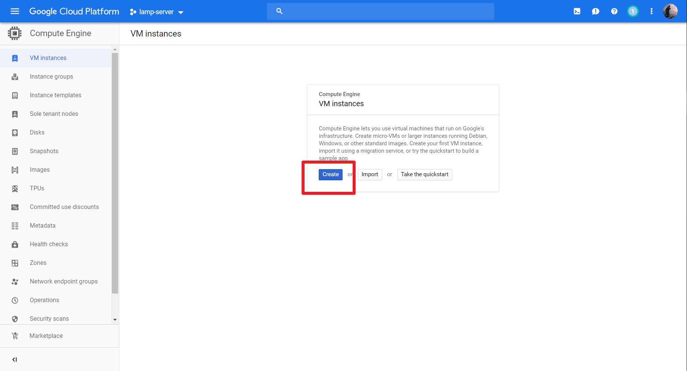
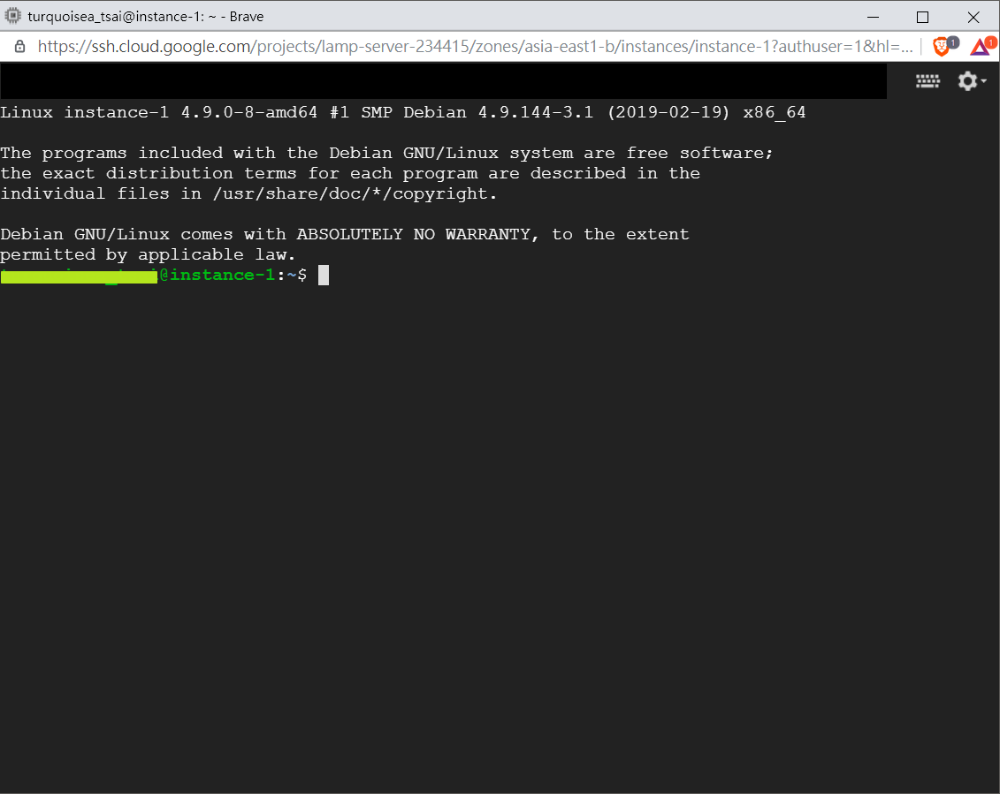

# Google Cloud Platform LAMP Server Setup
Set up LAMP (Linux, Apache2, MySQL, PHP7) on Google Cloud Platform Compute Engine, with OS Debian 9 Stretch. 
And connect to Cloud Storage to backup.

## Contents
- [Set up compute engine](https://github.com/cindytsai/Google-Cloud-Platform-LAMP-Server-Setup#set-up-compute-engine)
- [Set up cloud storage](https://github.com/cindytsai/Google-Cloud-Platform-LAMP-Server-Setup#set-up-cloud-storage)

## Set Up Compute Engine
###### 1.Create a project 

###### 2.Go to Google Compute Engine and create an instance

**Remember to allow full access to all Cloud APIs.** 

###### 3.Entering SSH

Time to setup your instance.

## Set Up Cloud Storage
###### 1.Go to Cloud Storage and create a bucket

**For more details :**
[Storage class](https://cloud.google.com/storage/docs/storage-classes) 
[Access control model](https://cloud.google.com/storage/docs/access-control/) 

